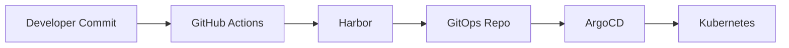

# Olá, eu sou o Paulo 👋

DevOps & Cloud Engineer focado em Kubernetes, GitOps e DevSecOps para ambientes enterprise.

---

## 🚀 Sobre mim

Engenheiro DevOps com experiência na construção de plataformas Kubernetes altamente disponíveis, pipelines CI/CD desacopladas do deploy e modelo GitOps com governança via Git.

Transformo requisitos complexos em ambientes:

- Escaláveis
- Determinísticos
- Auditáveis
- Automatizados ponta a ponta

---

## 🛠 Tech Stack & Ferramentas

| Categoria | Tecnologias |
|------------|-------------|
| Orquestração | Kubernetes, RKE2, Rancher |
| GitOps | ArgoCD, Helm |
| CI/CD | GitHub Actions |
| Containers | Docker, Harbor |
| DevSecOps | SonarQube, Trivy, OWASP ZAP |
| Observabilidade | Prometheus, Grafana, Loki |
| Cloud | AWS |
| Infraestrutura | Linux, IaC |

---

## 🏗 Arquitetura GitOps

---

## 🔋 Projeto Destaque – ChargePlus

Plataforma completa baseada em GitOps com:

- Promotion controlada (dev → homol → prod)
- Imagem imutável
- Post-deploy validation
- Pipeline versionada

🔗 Aplicação  
https://github.com/infratrust-ti/chargeplus  

🔗 GitOps  
https://github.com/infratrust-ti/gitops_rke2  

---

## 📊 Foco Atual

- Evolução de pipeline enterprise
- Segurança shift-left
- Governança via Git
- Automação de infraestrutura

---

📍 Brasil  
💼 Aberto a desafios técnicos e oportunidades em DevOps / Cloud
